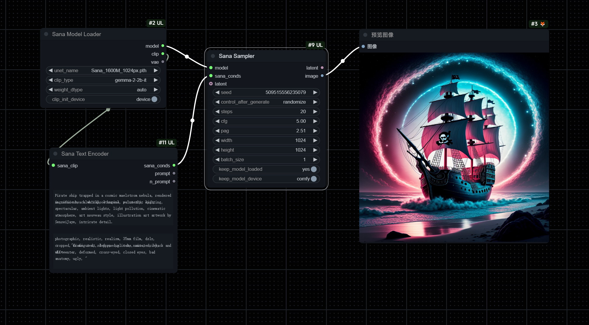

# Unofficial custom-node for [SANA: Efficient High-Resolution Image Synthesis with Linear Diffusion Transformer](https://github.com/NVlabs/Sana)
# Waiting for comfy official support [Add ⚡️Sana: Efficient High-Resolution Image Synthesis with Linear Diffusion Transformer Support](https://github.com/comfyanonymous/ComfyUI/issues/5785)!
# Warning: 
- A init node with lots of bugs, do not try unless interested.
- ram will not released (tried but failed).
- pag not work in `flow_euler` scheduler.
- test on rtx cuda-device with win10+py311+torch2.5.1+cuda126+diffusers(0.27~0.31)+mmcv(1.7.2&2.2.0).
## Known issue:
- Batch_size not work, it's a loop which i don't think is a good idea, so i left it empty.
## Hardware requirements:
- ram & vram: 16+gb ram, init model needs lots of ram. 4gb vram at least.
- text_encoder: gemma-2-2b-it ~ 5gb vram, gemma-2-2b-it-bnb-4bit ~ 2.3gb vram.
- dit: ~ 3.5gb vram.
- vae: ~ 3.1gb vram for 4k.
# workflow in `assets` dir 

# Instruction:
## dit: download from below links into `ComfyUI\models\unet`, only 1.6B-1204px works for now.
- https://huggingface.co/Efficient-Large-Model/Sana_1600M_1024px/blob/main/checkpoints/Sana_1600M_1024px.pth
- https://hf-mirror.com/Efficient-Large-Model/Sana_1600M_1024px/blob/main/checkpoints/Sana_1600M_1024px.pth China mainland users.
## vae: autodownload or manual download or git from below links into `ComfyUI\models\vae`, rename folder_name to `models--mit-han-lab--dc-ae-f32c32-sana-1.0`.
- https://huggingface.co/mit-han-lab/dc-ae-f32c32-in-1.0
- https://hf-mirror.com/mit-han-lab/dc-ae-f32c32-in-1.0 China mainland users.
## text_encoder: autodownload or manual download or git from below links into `ComfyUI\models\text_encoders`, rename folder_name to `models--unsloth--gemma-2-2b-it`.
- https://huggingface.co/unsloth/gemma-2-2b-it
- https://hf-mirror.com/unsloth/gemma-2-2b-it China mainland users.
### 4bit text_encoder: autodownload or manual download or git from below links into `ComfyUI\models\text_encoders`, rename folder_name to `models--unsloth--gemma-2-2b-it-bnb-4bit`. It will remain 1.5gb in vram after text_encode, which can be freed by `ComfyUI-Manager` `Free model and node cache`.
- https://huggingface.co/unsloth/gemma-2-2b-it-bnb-4bit
- https://hf-mirror.com/unsloth/gemma-2-2b-it-bnb-4bit China mainland users.
# About requirements:
- I only installed 2 modules, so i do not know what are really needed.