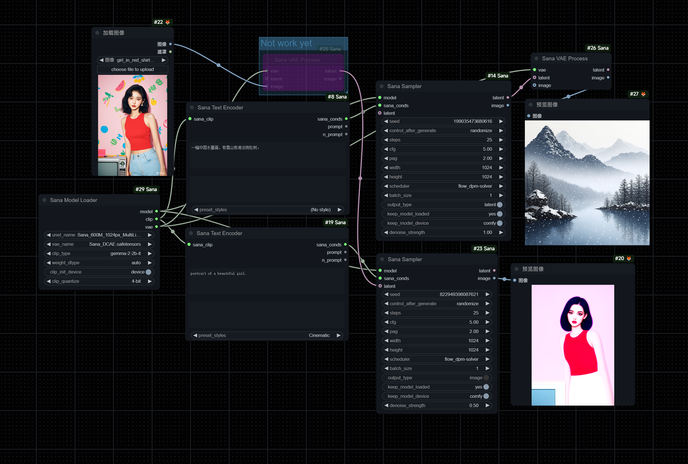

# Use official node [ComfyUI_ExtraModels](https://github.com/city96/ComfyUI_ExtraModels) instead.
# Unofficial wrapper custom-node for [SANA: Efficient High-Resolution Image Synthesis with Linear Diffusion Transformer](https://github.com/NVlabs/Sana)
# Waiting for comfy official support [Add ⚡️Sana: Efficient High-Resolution Image Synthesis with Linear Diffusion Transformer Support](https://github.com/comfyanonymous/ComfyUI/issues/5785)!
# Sorry for the wrong links of [vae_model](https://github.com/zmwv823/ComfyUI-Sana/issues/3), now should be right one.
# Warning: 
- A init wrapper node with lots of bugs, do not try unless interested.
- Ram will not released (tried but failed).
- If select `gemma-2-2b-it` and apply `clip_quantize`, parts of text_encoder will remain in vram.
- Test on rtx cuda-device with win10+py311+torch2.5.1+cuda126.
- If use comfy vae decode node, output image size maybe not same as input.
## Known issue:
- Batch_size not work, it's a loop which i don't think is a good idea, so i left it empty.
- Image2image not work.
## Hardware requirements:
- ram & vram: init 1.6b model needs lots of ram (16+gb sys ram recommended), minimal 2gb vram for 0.6b denoise latent (inference).
- text_encoder: gemma-2-2b-it ~ 5gb vram, gemma-2-2b-it-bnb-4bit ~ 2.3gb vram.
- model: 0.6b: ~ 1.5gb vram and faster, 1.6b: ~ 3.5gb vram.
- vae: ~ 3.1gb vram.
# workflow in `workflow` dir 

# Instruction:
## model: download model_file such as `Sana_1600M_512px_MultiLing.pth` from below links into `ComfyUI\models\unet`, only non-diffusers 1024px model(0.6b、1.6b including MultiLing) works in this custom-node for now.
- https://huggingface.co/collections/Efficient-Large-Model/sana-673efba2a57ed99843f11f9e
- https://hf-mirror.com/collections/Efficient-Large-Model/sana-673efba2a57ed99843f11f9e China mainland users.
## vae: download from below links into `ComfyUI\models\vae`, rename model_name to any.
- https://huggingface.co/mit-han-lab/dc-ae-f32c32-sana-1.0/blob/main/model.safetensors
- https://hf-mirror.com/mit-han-lab/dc-ae-f32c32-sana-1.0/blob/main/model.safetensors China mainland users.
## text_encoder: autodownload or manual download or git from below links into `ComfyUI\models\text_encoders`, rename folder_name to `models--unsloth--gemma-2-2b-it`.
- https://huggingface.co/unsloth/gemma-2-2b-it
- https://hf-mirror.com/unsloth/gemma-2-2b-it China mainland users.
### 4bit text_encoder, less resource consumption: autodownload or manual download or git from below links into `ComfyUI\models\text_encoders`, rename folder_name to `models--unsloth--gemma-2-2b-it-bnb-4bit`. It will remain 1.5gb in vram after text_encode, which can be freed by `ComfyUI-Manager` `Free model and node cache`.
- https://huggingface.co/unsloth/gemma-2-2b-it-bnb-4bit
- https://hf-mirror.com/unsloth/gemma-2-2b-it-bnb-4bit China mainland users.
# About requirements:
- I only installed 2 modules, so i do not know what are really needed.